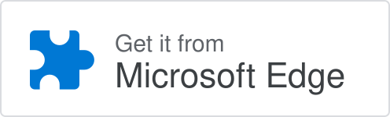

<div align="center">

<a href="https://stan-key.com/?hl=zh_CN">
  <picture>
    <source media="(prefers-color-scheme: dark)" srcset="./assets/brand/stan-lockup-dark.svg">
    
  </picture>
</a>

# Stan — Steam 比价 / Steam Key 比价浏览器扩展

### 在 Steam 页面和愿望单中直接比较价格。

**Stan 会将你正在查看的 Steam 价格，与经过验证且兼容的 Steam Key 优惠进行比较。**<br>
无需账户，无需另开标签页。只有在比较得到验证时才会显示。

<br>

<a href="https://chromewebstore.google.com/detail/ehhomikpbeokopccgmienllpnambnkif"></a>&nbsp;
<a href="https://microsoftedge.microsoft.com/addons/detail/mifpmbmnhmjgdmagibinlgmigbabmaml"></a>&nbsp;
<a href="https://addons.mozilla.org/firefox/addon/stan-steam-price-comparison/"></a>&nbsp;
<a href="https://apps.apple.com/app/stan-steam-price-checker/id6803592430"></a>

[**Chrome 网上应用店安装**](https://chromewebstore.google.com/detail/ehhomikpbeokopccgmienllpnambnkif) · [**Firefox Add-ons 安装**](https://addons.mozilla.org/firefox/addon/stan-steam-price-comparison/) · [**简体中文安装指南**](./INSTALL.zh-CN.md)

官方商店是推荐的安装和更新渠道。指南也介绍如何检查当前 Chrome 官方包，以及商店无法访问时的手动安装备用方式。

[官网](https://stan-key.com/?hl=zh_CN) · [查看扩展源码](./extension/) · [透明度说明](./TRANSPARENCY.md) · [快速审计](./AUDIT_GUIDE.md) · [最新 Release](https://github.com/stan-key/extension-source/releases/latest) · [English](./README.md)

</div>

---

## 隐私，从设计开始。

你在浏览器中运行的代码都公开在这个仓库里。以下是它的承诺，以及你可以自行核对的位置。

**无需账户。**
无需注册或登录即可使用 Stan，你的操作不会关联到姓名、邮箱或个人档案。

**只在 Steam 页面运行。**
Stan 只在 Steam 游戏页面和愿望单上运行，不请求 `<all_urls>`、浏览历史、cookies、`tabs` 或 `webRequest`。[查看权限](./security/permissions.json)

**不读取私密信息。**
Stan 不读取 Steam 密码、访问令牌、结账字段或支付信息，只读取 Steam 已经向你展示的游戏、版本和价格。[查看数据流](./DATA_FLOW.md)

**只有一个目的地。**
扩展只与 `https://api.stan-key.com` 通信，不携带 cookies 或凭据，并拒绝重定向。[查看网络白名单](./security/network-allowlist.json)

**没有远程代码。**
所有运行的代码都包含在经过商店审核的发布包中：Manifest V3，不使用 `eval`，不加载远程脚本。

**不确定时保持安静。**
如果 edition、激活区域、库存、价格或时效无法验证，Stan 不会猜测，也不会显示购买按钮。

## 选择你的浏览器

| 浏览器 | 官方商店 | 可在此检查的代码 |
| --- | --- | --- |
| Google Chrome | [Chrome 网上应用店](https://chromewebstore.google.com/detail/ehhomikpbeokopccgmienllpnambnkif) | [`extension/chrome/`](./extension/chrome/) |
| Microsoft Edge | [Microsoft Edge 加载项](https://microsoftedge.microsoft.com/addons/detail/mifpmbmnhmjgdmagibinlgmigbabmaml) | 与 Chrome 相同源码构建的 Chromium 包：[`extension/chrome/`](./extension/chrome/) |
| Mozilla Firefox | [Firefox Add-ons](https://addons.mozilla.org/firefox/addon/stan-steam-price-comparison/) | [`extension/firefox/`](./extension/firefox/) |
| iPhone、iPad 和 Mac 上的 Safari | [App Store](https://apps.apple.com/app/stan-steam-price-checker/id6803592430) | [`extension/safari/`](./extension/safari/) |

各商店在不同国家或地区的上架情况可能不同。通过官方商店安装可获得自动更新。

## 下载和验证官方版本

GitHub Release 中的 `stan-chrome-2.0.1.zip` 是与 Chrome provider 验证并提交的完全相同的 ZIP，不存在单独的“中国版”安装包。

- 当前版本：`2.0.1`
- ZIP：[`stan-chrome-2.0.1.zip`](https://github.com/stan-key/extension-source/releases/download/latest/stan-chrome-2.0.1.zip)
- SHA-256：[`stan-chrome-2.0.1.zip.sha256`](https://github.com/stan-key/extension-source/releases/download/latest/stan-chrome-2.0.1.zip.sha256)
- [可选：按步骤手动安装](./INSTALL.zh-CN.md)

SHA-256 是可选的信号，不是非技术用户的安装前提。请只从[官方 Release](https://github.com/stan-key/extension-source/releases/latest)下载，不要使用未记录的镜像。手动安装不会获得 Chrome 网上应用店的自动更新。

## 不必相信我们，亲自验证

一条命令即可确认商店分发的包与本仓库中的代码逐字节一致：

```sh
./tools/audit-release all
```

[`snapshot.json`](./snapshot.json) 为 Chrome、Firefox 和 Safari 分别记录版本、发布包与源码的 SHA-256、manifest 哈希及发布方交接记录。审计会检查 GitHub Release、校验文件、包内容、源码槽位、权限、网络与数据契约；报告明确区分 `PASS`、`FAIL` 和 `NOT_CHECKED`，无法完成的检查绝不会被记为通过。查看[可审计工程栈](./AUDITABLE_STACK.md)和[审计步骤](./AUDIT_GUIDE.md)。

## 购买前先比较，无需离开 Steam

Steam 已经展示了游戏，**Stan 补上价格比较。** 当存在可以可靠比较的优惠时，它会显示在你正在查看的 Steam 价格旁边。无需另开比价网站，也无需创建账户。

Stan 会检查 Steam Key 激活、市场兼容性、库存以及可比最终价格。如果 edition、package、market 或 price 存在歧义，Stan 不会猜测，也不会显示购买 CTA。

## 权限一览

Chrome、Edge 和 Firefox 发布包只声明 `storage` 权限，host permission 仅限 `https://api.stan-key.com/*`。Safari 的扩展包还声明 Steam host access，以支持其内容脚本。所有发布包都不请求 `tabs`、浏览历史、cookies、`webRequest` 或 `<all_urls>`，也不加载远程可执行代码。完整权限按浏览器列在 [`security/permissions.json`](./security/permissions.json)。

浏览器端实际发布的代码可在 [`extension/`](./extension/) 中检查。Chrome 版本：`2.0.1` · SHA-256：`ead9eaa04d1fd5f87f54e3ddacf228cc50f12e8af8a152ec9d1e74d117fae594`。

部分商家链接是联盟链接。联盟佣金不会改变排序；符合条件的优惠按可比最终价格排序。

[查看 `snapshot.json`](./snapshot.json) · [查看权限与隐私说明](./TRANSPARENCY.md) · [隐私政策](https://stan-key.com/privacy)

> Stan 是独立产品。Steam 和 Valve 是 Valve Corporation 的商标。Stan 并非由 Valve 提供、认可或支持。
