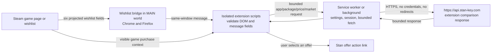

# Browser extension architecture

The extension separates Steam page access, browser APIs and network requests
into distinct execution contexts. Each context receives only the data needed
for its role.

## Wishlist bridge

The page-world bridge reads the loaded wishlist item data needed to identify
the package. It projects only the schema in
[`security/main-world-schema.json`](./security/main-world-schema.json), then
posts to `window.location.origin`. It does not copy the complete Steam object,
URL, credential or access token. It has no network, cookie, storage or
extension API access. If it cannot find the data, it stops after bounded
attempts and emits no item.

The isolated script treats each message as untrusted page input. It checks the
message type and origin, validates field types and limits, then confirms the
IDs and formatted price against the row displayed by Steam before requesting
offers. A malformed, stale or mismatched row fails closed.

## Network response handling

The service worker uses the single API origin in
[`security/network-allowlist.json`](./security/network-allowlist.json). Its
fetch wrapper omits credentials, refuses redirects, uses a five-second timeout
and caps JSON response bodies at 128 KiB. Action and provider-logo URLs are
checked against the documented origins before use. The extension contains no
remote executable scripts.

Safari uses the provider-specific manifest in `extension/safari/`. Its
declared Steam host permission is documented separately from the API
destination; see [`SAFARI.md`](./SAFARI.md).
